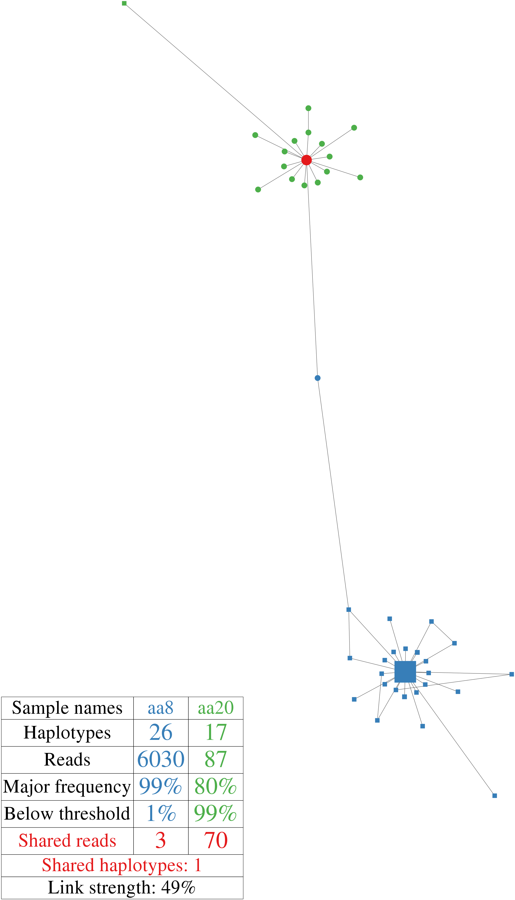
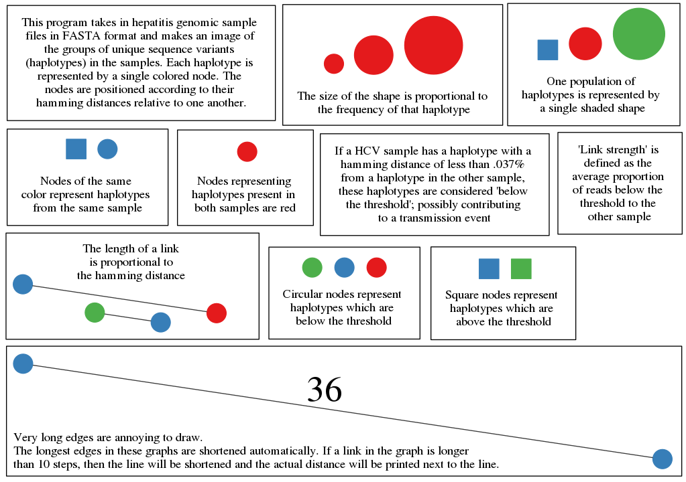

# draw 'K-step' 

This package renders a 'k-step' diagram of some viral quasispecies populations and how close/far they are from each other!

a 'k-step' diagram is defined as a graphical representation of the union of all minimum spanning trees over a given sequence set.
Call this on a group of amplicon-sequenced quasispecies to make a picture to visually inspect how the clouds of quasispecies interact with one another

## Example



## How to interpret these diagrams



## Prerequisites

### nonstandard python modules

biopython
networkx
numpy
[pygraphviz](https://pypi.org/project/pygraphviz/)

### other prerequisites

[mafft](http://mafft.cbrc.jp/alignment/software)
[graphviz](https://www.graphviz.org/download)

##### Potentially useful tip:
When configuring graphviz, you may find the following configure command useful:
```
./configure  --enable-perl=no --enable-python27=yes --enable-java=no --enable-r=no --enable-ruby=no --enable-tcl=no --prefix ~/.local/
```
# A note about input formatting
Input must be a valid FASTA file.

This program expects viral quasispecies populations (a pool of closely related mutants achieved through deep amplicon sequencing)

For each entry, your sequence ID should end with a number following the trailing underscore which denotes the frequency of that variant. For example, here we have a sequence ID with a bunch of extra information that will give the appropriate frequency of 25 for that variant

```
>P06_run12_alaska_3_2_25
```
# What else is in this repository?
A sample file (test.fas) so you can run a test case! Here's how to invoke the script (assuming all files are in your current working directory)

```
python drawkstep.py test.fas
```

# Acknowledgements
The rest of the DVH bioinformatics team @ CDC
